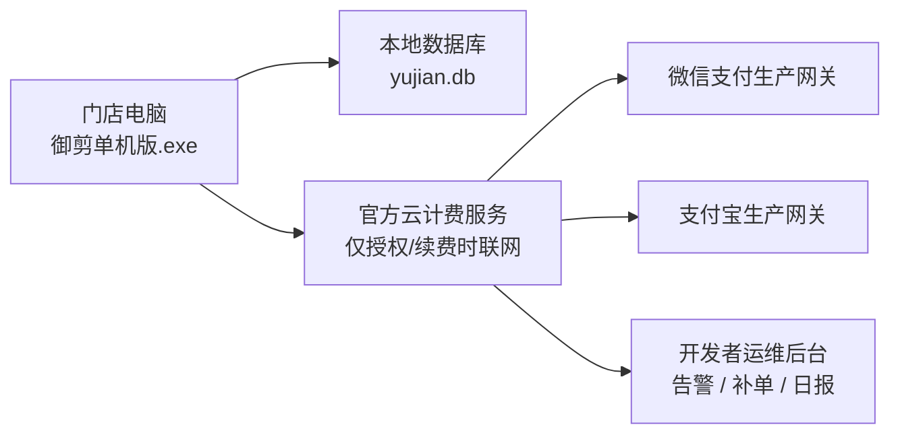
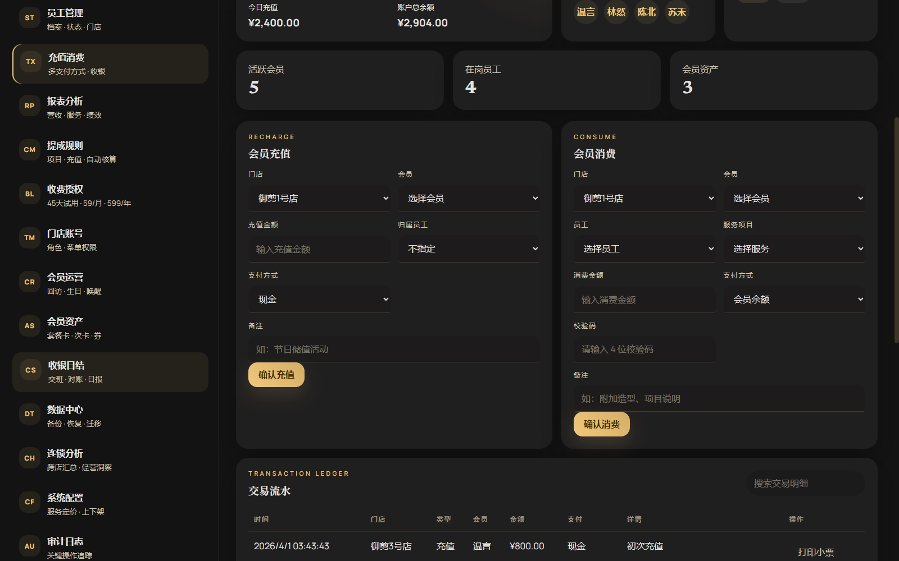
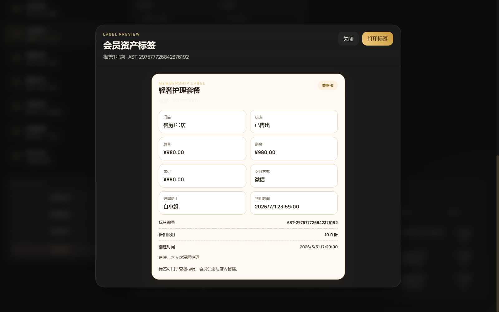
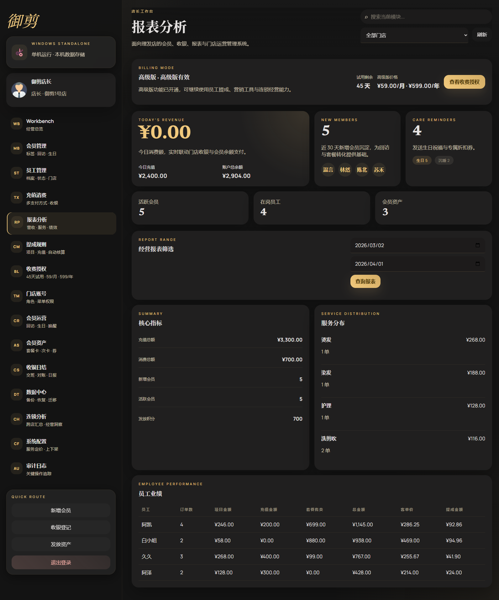

# 御剪


<p align="center">
  面向理发店 / 美发门店的经营管理系统<br/>
  <strong>Windows 单机稳定经营 + 官方云计费服务 + 可持续订阅收费</strong>
</p>

<p align="center">
  
</p>

> 这不是一套“只适合演示”的空壳后台，而是一套围绕 **理发店真实经营场景** 打造的系统：
> **能收银、能管会员、能算提成、能做连锁分析，还能把收费续费链路真正跑通。**

---

## 御剪是什么

御剪是一套专门面向理发店、美发工作室、连锁门店的经营管理系统。

它的设计思路很明确：

- **平时经营，本地单机运行**
- **会员、员工、收银、报表数据保存在本机**
- **只有订阅续费 / 授权验证时才连接官方云计费服务**
- **微信 / 支付宝真实收款参数统一由开发者云端托管**
- **门店端不暴露开发者收款配置，更适合正式商业发行**

一句话概括：

> **先帮门店把生意跑起来，再帮发行方把收费闭环跑通。**

---

## 为什么御剪更适合理发店

理发店老板最看重的，通常不是“功能有多少”，而是下面这几件事：

- 开门就能用，别太依赖网络
- 收银、储值、会员、员工提成要顺手
- 门店数据要留在自己电脑里，安心
- 连锁店以后能继续扩展，不用推倒重来
- 软件收费要清晰，别搞复杂

御剪围绕这些点做了专门设计：

- **Windows 单文件运行**，适合前台主机直接落地
- **SQLite 本地库**，备份、迁移、恢复简单
- **店长 / 店员角色分离**，菜单权限细化
- **会员运营 + 会员资产 + 提成规则** 一体化
- **45 天免费试用 + 月付 / 年付高级版**，更容易打开市场
- **官方云计费服务独立部署**，发行方统一掌控续费和收款

---

## 产品结构



### 门店端：Windows 单机版
- 单文件运行
- 断网不影响大部分日常经营
- 数据保存在本机，更适合门店实际使用习惯
- 适合单店、夫妻店、工作室、连锁门店前台电脑

### 云端：官方云计费服务
- 负责试用期、续费、下单、支付回调、补单、退款、对账
- 微信 / 支付宝生产参数只保留在开发者云端
- 门店端只做授权校验，不管理开发者收款配置

---

## 当前版本核心能力

| 模块 | 功能说明 | 版本 |
| --- | --- | --- |
| 安装与登录 | 首次安装向导、门店初始化、账号登录、角色识别 | 基础版 |
| 门店账号 | 店长 / 店员、多角色、细粒度菜单权限 | 基础版 |
| 会员管理 | 会员档案、标签、生日、积分、状态管理 | 基础版 |
| 员工管理 | 员工档案、所属门店、状态、角色归属 | 基础版 |
| 收银登记 | 会员充值、会员消费、多支付方式、交易流水 | 基础版 |
| 打印能力 | 小票打印、会员资产标签打印、打印日志 | 基础版 |
| 会员运营 | 回访提醒、生日关怀、沉睡唤醒 | 高级版 |
| 会员资产 | 套餐卡、次卡、折扣券、积分体系 | 高级版 |
| 提成规则 | 项目提成、充值提成、套餐售卖提成自动核算 | 高级版 |
| 收银日结 | 交班、对账、日结日报 | 基础版 |
| 数据中心 | 备份、恢复、迁移 | 基础版 |
| 连锁分析 | 多店汇总、跨店经营、店铺维度分析 | 高级版 |
| 收费授权 | 45 天试用、59 元 / 月、599 元 / 年、续费链路 | 基础版 + 高级版 |
| 开发者运维 | 告警、补单、支付日报、对账导出 | 开发者侧 |

---

## 真实界面预览

> 以下截图均来自当前版本真实运行界面，**不是设计稿**。
> 截图中的金额、会员、员工、门店均为演示环境数据。

### 首次安装向导


### 工作台总览


### 会员管理


### 收银登记与交易流水


### 会员充值小票打印预览


### 会员资产标签打印预览


### 经营报表分析


---

## 收费模式

### 基础版
- 新注册门店 **45 天免费试用**
- 满足日常经营主链路：
  - 开单收银
  - 简单会员录入
  - 基础经营报表
  - 本地数据沉淀

### 高级版
- **59 元 / 月**
- **599 元 / 年**

高级版重点能力：
- 员工提成自动核算
- 会员运营与营销能力
- 套餐卡 / 次卡 / 积分等会员资产体系
- 连锁门店数据汇总与经营分析

这个收费模型的核心逻辑是：

> **先低门槛进入门店，再用高价值功能完成续费转化。**

---

## 适合谁使用

### 门店老板
想要一套真正能落地、能把客户和收银管起来的系统。

### 店长
想要更高效地管理员工、会员、套餐、提成和经营数据。

### 连锁经营者
想要做多店汇总、门店对比和跨店经营分析。

### 软件发行方 / 代理
想要用 **单机版 + 官方云计费服务** 跑通可持续收费闭环。

---

## 快速开始

### 方式一：直接使用发布包
如果你拿到的是已经打包好的客户发布文件，直接运行：

```text
御剪单机版.exe
```

首次打开后：
1. 进入安装向导
2. 填写门店名称、管理员账号、密码、联系电话
3. 完成初始化后即可开始使用

> 系统**没有默认账号和默认密码**，首次安装时由门店自行创建。

---

### 方式二：本地开发启动

### 1. 前端构建
```powershell
cd frontend
npm install
npm run build
```

### 2. 后端打包
```powershell
mvn -DskipTests package
```

### 3. 本地运行
```powershell
java -cp "target\ddmo-1.0.0.jar;target\lib\*" com.ddmo.app.DdmoLauncher
```

---

## 打包 Windows 单机版

```powershell
.\build-single-file.ps1
```

打包产物：

```text
dist\御剪单机版.exe
```

默认本地数据库路径：

```text
%LOCALAPPDATA%\Yujian\data\yujian.db
```

---

## 官方云计费服务

如果你需要跑正式的订阅收费链路，可继续部署官方云计费服务。

它负责：
- 试用授权
- 续费下单
- 支付回调
- 订单作废 / 退款
- 补单重试
- 支付对账日报
- 运维后台告警 / 日报 / 补单日志

相关脚本：

```powershell
.\build-cloud-billing-server-bundle.ps1
```

相关文档：
- [官方云计费服务部署说明](docs/official-cloud-billing-server-deployment.md)
- [官方云计费服务说明](docs/official-cloud-billing-guide.md)
- [生产部署说明](docs/production-deployment-guide.md)
- [支付运维说明](docs/payment-ops-guide.md)
- [支付生产联调清单](docs/payment-production-final-checklist.md)
- [支付回调验签上线检查表](docs/payment-callback-signature-go-live-checklist.md)

---

## 文档目录

### 项目文档
- [御剪-项目总结](docs/御剪-项目总结.md)
- [御剪-部署教程](docs/御剪-部署教程.md)
- [御剪-操作手册](docs/御剪-操作手册.md)

### 对外交付文档
- [御剪-最终交付版说明书](docs/御剪-最终交付版说明书.md)
- [御剪-门店老板简版使用手册](docs/御剪-门店老板简版使用手册.md)

### 发行方 / 支付配置文档
- [开发者支付网关说明](docs/developer-payment-gateway-guide.md)
- [官方云计费服务部署说明](docs/official-cloud-billing-server-deployment.md)
- [支付运维说明](docs/payment-ops-guide.md)

---

## 当前版本已经做到什么程度

当前版本已经不是“概念 Demo”，而是**可以正式演示、正式交付、正式收费演进**的一套系统：

- 可以直接打包成 Windows 单机版发给门店使用
- 可以完成首次安装初始化和本地经营落地
- 可以支持会员、员工、收银、报表、资产、提成等主链路
- 可以支持小票打印 / 标签打印
- 可以跑 45 天免费试用 + 月付 / 年付高级版
- 可以对接官方云计费服务，统一完成开发者收款与续费管理
- 可以通过开发者后台查看告警、补单与支付日报

---

## 下一步最值得继续增强的方向

- 微信小程序预约
- 短信营销
- 库存耗材管理
- 自动更新能力
- 打印模板扩展（80mm 热敏纸 / 不同标签尺寸 / 指定打印机）

---

## 项目亮点总结

如果你想找的是一套：

- **适合理发店真实经营**
- **能本地稳定运行**
- **方便发行和收费**
- **还能继续演进成连锁经营系统**

那么御剪不是“只能看”的后台，而是一套**可以拿去卖、拿去装、拿去续费、拿去长期演进**的产品底座。

---

## 发布包建议

正式发客户时，建议至少包含：

- `御剪单机版.exe`
- `御剪-最终交付版说明书.pdf`
- `御剪-门店老板简版使用手册.pdf`
- `安装与使用注意事项.txt`

---

## License

如需商用发行、二次定制或代理合作，请结合你的实际授权策略自行补充 License 与商务说明。
